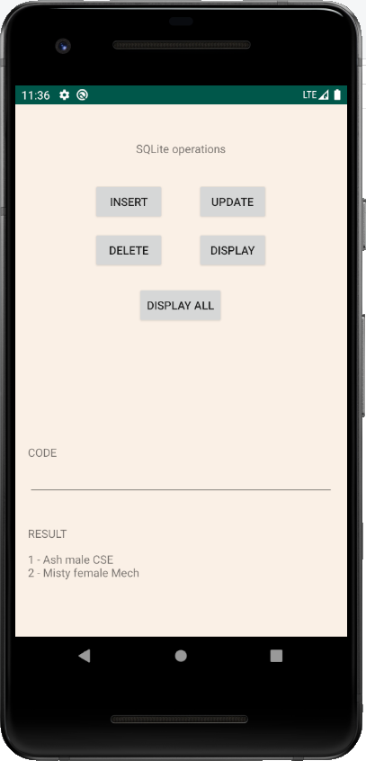
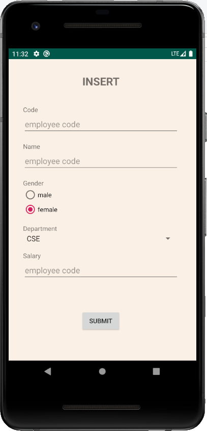
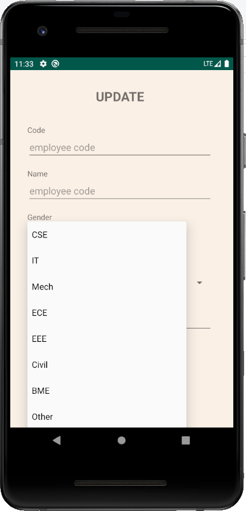
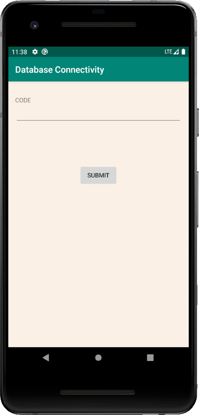

# Android Application Development using Database

In main activity have the followingbuttons:
  Create, Insert, Update, Delete, Retrieve.
 
1) On clicking CreateButton, create a new database to store the following contents. (Use SQLite Database)  
  a. Name  
  b. Gender  
  c. Employee Code  
  d. Department  
  e. Salary  
 
2) On Clicking Insert, move to a new view which contains the following details:(Insert new Employee to the database)  
  a. Name(EditText-Validation checking-Alphabet)  
  b. Gender (RadioButton)  
  c. Employee Code(EditText-Validation checking-Alphanumeric)  
  d. Department (Spinner)  
  e. Salary(EditText-Validation checking-Numeric)  
  f. Submit (Button)–On press,Insert the data into database.  

3) On clicking Update,move to a new view which contains above details and Update by Employee Code.
4) On clicking Delete, Delete the whole row in the table by Employee Code.
5) On clicking Retrieve, Retrieve an employeeby Employee Code.Also retrieve the details of all the employeesin a particular department

#### Screenshots

